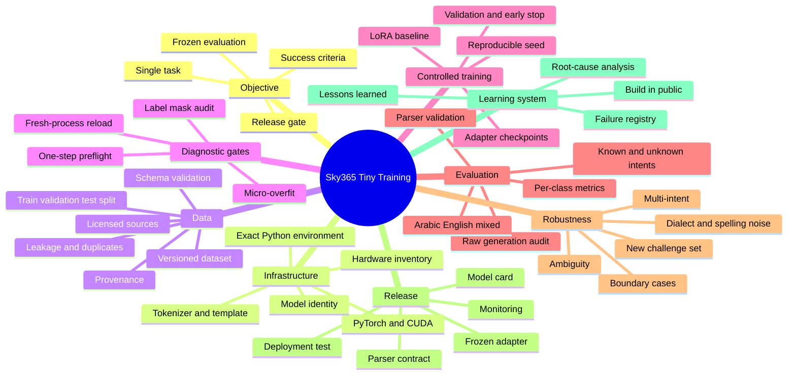
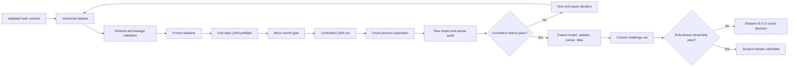

# Sky365 Tiny Training Lab

> A reproducible operating system for moving from validated knowledge to a tested small-model release.

[](./training/experiments/GEMMA-3-270M-IT-LORA-v0.1.md)
[](./training/CURRENT-STATE.md)
[](./training/experiments/GEMMA-3-270M-IT-LORA-v0.1.md)
[](./training/CURRENT-STATE.md)
[](./training/CURRENT-STATE.md)
[](./DATA-AND-LEGAL-POLICY.md)

## Mission

Build a small, local, reproducible model-training pipeline that proves one scoped task end to end before expanding to larger datasets, more modules, or more advanced optimization.

## Latest milestone — Gemma 3 270M IT LoRA v0.1

The first controlled Gemma experiment has reached:

```text
Decision: PASS-AFTER-PARSER-FIX
Model: google/gemma-3-270m-it
Dataset: 64 train / 16 validation / 20 held-out test
Validation parsed accuracy: 16/16
Held-out test parsed accuracy: 20/20
Valid JSON after parser correction: 48/48
Wrong intents: 0
Parser failures remaining: 0
```

The initial evaluator reported 0% because the model repeated correct JSON objects with `<end_of_turn>` and the parser combined them into one invalid value. The preserved predictions were rescored after one isolated parser correction, without retraining or changing weights, data, or decoding.

> **Interpretation boundary:** This is a successful controlled experiment, not a production-readiness claim. The next gate is a newly authored unseen 60-case robustness challenge.

### Read the evidence

- [Full methodology and experiment record](./training/experiments/GEMMA-3-270M-IT-LORA-v0.1.md)
- [Current Training State](./training/CURRENT-STATE.md)
- [Experiments Index](./training/experiments/INDEX.md)
- [Standalone public HTML case study](./training/public/gemma-3-270m-it-lora-v0.1.html)
- [Build in Public video brief](./training/public/VIDEO-BRIEF-GEMMA-270M-LORA-v0.1.md)

## Current operating model

| Layer | Purpose | Exit condition |
|---|---|---|
| **Infrastructure** | Prove runtime, device, packages, paths, and model loading | Deterministic smoke/preflight completes |
| **Training Pipeline** | Train one scoped task and preserve all evidence | Adapter reloads and passes held-out task evaluation |
| **Robustness** | Test frozen artifacts on newly authored challenge cases | Thresholds pass without training leakage |
| **Optimization** | Reduce memory, improve speed, or expand capability | Improvement is measured against the frozen baseline |

> **Rule:** Optimization cannot replace proof. QLoRA, quantization, merging, routers, and MoE are introduced only after baseline and robustness gates justify them.

## Training mind map



## Canonical flow



## Knowledge-to-training controls

The original Knowledge-OS controls remain mandatory:

```text
Validated Graph Claims
→ Dataset Factory
→ Teacher Review
→ Training/Evaluation Split
→ Student Training
→ Independent Evaluation
→ Release Gate
→ Monitoring and Feedback
```

The same model configuration must not generate, validate, and judge the same records without independent controls. Source verification, deterministic validators, held-out data, different models where appropriate, and human review remain required.

## Required release gates

A dataset or model release must pass:

1. schema validation;
2. source and license eligibility;
3. claim-to-evidence traceability where applicable;
4. duplicate and contamination checks;
5. frozen held-out evaluation;
6. raw-output and parser verification;
7. multilingual terminology checks;
8. domain-specific safety checks;
9. independent robustness evaluation;
10. documented human approval for the declared scope.

## Training Lab navigation

| Page | Purpose |
|---|---|
| [Current State](./training/CURRENT-STATE.md) | Live source of truth for model, environment, result, limitation, and next action |
| [Experiments Index](./training/experiments/INDEX.md) | Durable records of completed experiments and decision gates |
| [Gemma LoRA v0.1 Methodology](./training/experiments/GEMMA-3-270M-IT-LORA-v0.1.md) | Complete technical record of the first successful controlled Gemma experiment |
| [Public HTML Case Study](./training/public/gemma-3-270m-it-lora-v0.1.html) | Self-contained visual page for demos and future GitHub Pages publication |
| [Build in Public Video Brief](./training/public/VIDEO-BRIEF-GEMMA-270M-LORA-v0.1.md) | Analytical live-video structure, evidence rules, and short-form clips |
| [Audit Index](./training/audits/2026-08-06/INDEX.md) | Indexed snapshot of the local discovery audit |
| [Training Mind Map](./training/TRAINING-MIND-MAP.md) | Complete conceptual map and decision gates |
| [Training Playbook](./training/TRAINING-PLAYBOOK.md) | Repeatable route from an empty environment to a verified result |
| [Dataset Pipeline](./training/DATASET-PIPELINE.md) | Dataset lifecycle, formats, validation, and provenance |
| [Evaluation Framework](./training/EVALUATION-FRAMEWORK.md) | Baselines, metrics, release gates, and regression tests |
| [Troubleshooting](./training/TROUBLESHOOTING.md) | Evidence-first diagnosis and common failure classes |
| [Lessons Learned](./training/LESSONS-LEARNED.md) | Durable record of discoveries, failures, and corrections |

## Immediate next action

Freeze the current base model, LoRA adapter, parser fix, dataset v0.1, and training configuration. Run the existing adapter—without new training—against a newly authored 60-case challenge set.

Proposed thresholds:

```text
Valid JSON: 60/60
Overall parsed accuracy: at least 85%
Known-intent accuracy: at least 90%
Unknown handling: at least 80%
Parser failures: 0
```

The challenge-set result will be appended to the methodology document and public HTML page as the next Build in Public milestone.
