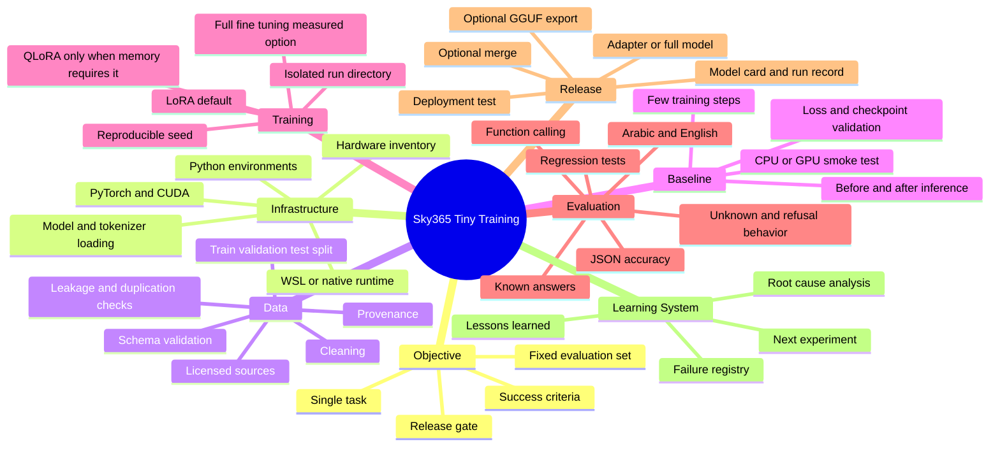
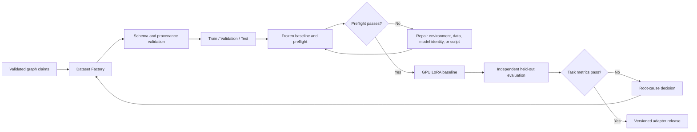

# Sky365 Tiny Training Lab

> A reproducible operating system for moving from validated knowledge to a tested small-model release.

[](./training/CURRENT-STATE.md)
[](./training/CURRENT-STATE.md)
[](./training/prompts/STAGE-2-LORA-EXECUTION-PROMPT.md)
[](./training/audits/2026-08-06/INDEX.md)
[](./DATA-AND-LEGAL-POLICY.md)

## Mission

Build a small, local, reproducible model-training pipeline that can prove one task end to end before expanding scope.

The immediate goal is not to add every optimization technique. It is to achieve one verified training success with:

- one clearly identified model;
- one clean dataset;
- one isolated environment;
- one repeatable command;
- one measurable evaluation;
- one preserved training record.

## Current status

The local audit is complete enough to prove that the machine is capable of small GPU training runs.

```text
Active environment: Q:\Colibri\training\venv-py311
Python: 3.11.9
PyTorch: 2.6.0+cu124
CUDA available: true
GPU: Quadro P2000 4GB
PEFT / TRL: verified
```

The previous ByT5 run proved that the GPU training loop works, but its outputs remained semantically incorrect. Therefore the project is now at the **Stage 2 LoRA preflight**, not at a successful trained-model release.

See:

- [Current State](./training/CURRENT-STATE.md)
- [Audit Snapshot Index — 2026-08-06](./training/audits/2026-08-06/INDEX.md)
- [Stage 2 LoRA Execution Prompt](./training/prompts/STAGE-2-LORA-EXECUTION-PROMPT.md)

## Current operating model

| Layer | Purpose | Exit condition |
|---|---|---|
| **Infrastructure** | Prove the runtime, device, packages, paths, and model loading | A deterministic smoke test completes |
| **Training Pipeline** | Train one scoped task and preserve all evidence | A valid checkpoint or adapter passes evaluation |
| **Optimization** | Reduce memory, improve speed, or extend capability | Improvement is measured against the baseline |

> **Rule:** Optimization cannot replace proof. QLoRA, quantization, merging, routers, and MoE are introduced only after the baseline pipeline is verified.

## Training mind map



## Canonical flow



## Knowledge-to-training flow

The original Knowledge OS controls remain mandatory:

```text
Validated Graph Claims
→ Dataset Factory
→ Teacher Review
→ Training/Evaluation Split
→ Student Training
→ Independent Evaluation
→ Release Gate
→ Monitoring and Feedback
```

### Teacher model

Generates, critiques, compares, and revises candidate learning items. Teacher approval is not sufficient by itself; outputs remain bound to source and graph validation.

### Dataset Factory

Converts eligible graph claims into task-specific records, deduplicates them, assigns difficulty and domain metadata, and preserves claim-level provenance.

### Student model

Learns from approved training records. Student behavior must be evaluated independently from the teacher used to generate the data.

## Required dataset partitions

- training;
- validation;
- held-out test;
- adversarial and contradiction set;
- provenance audit sample;
- multilingual consistency sample;
- domain-expert review sample.

## Release gates

A dataset or model release must pass:

1. schema validation;
2. source and license eligibility;
3. claim-to-evidence traceability;
4. duplicate and contamination checks;
5. unsupported-claim threshold;
6. bias and representation review;
7. multilingual terminology checks;
8. domain-specific safety checks;
9. independent benchmark evaluation;
10. documented human approval for the release scope.

## Non-circular evaluation rule

The same model configuration must not generate, validate, and judge the same records without independent controls. Use source verification, different models where appropriate, deterministic validators, held-out data, and human review.

## Feedback loop

Evaluation failures must update the graph or dataset lineage rather than being patched only in model prompts. The system should identify whether the root cause is source quality, concept mapping, relation error, generation prompt, dataset transformation, environment mismatch, training configuration, or model limitation.

## Training Lab navigation

| Page | Purpose |
|---|---|
| [Current State](./training/CURRENT-STATE.md) | Live source of truth for environment, target, blockers, and next action |
| [Audit Index](./training/audits/2026-08-06/INDEX.md) | Indexed snapshot of the completed local discovery audit |
| [Stage 2 LoRA Prompt](./training/prompts/STAGE-2-LORA-EXECUTION-PROMPT.md) | Full preflight, execution, evaluation, and documentation contract |
| [Training Mind Map](./training/TRAINING-MIND-MAP.md) | Complete conceptual map and decision gates |
| [Training Playbook](./training/TRAINING-PLAYBOOK.md) | Repeatable route from an empty environment to a verified result |
| [Environment Setup](./training/ENVIRONMENT-SETUP.md) | Runtime discovery and environment isolation rules |
| [Dataset Pipeline](./training/DATASET-PIPELINE.md) | Dataset lifecycle, formats, validation, and provenance |
| [Experiment Lifecycle](./training/EXPERIMENT-LIFECYCLE.md) | Run naming, logging, checkpoints, and comparison |
| [Evaluation Framework](./training/EVALUATION-FRAMEWORK.md) | Baselines, metrics, release gates, and regression tests |
| [Troubleshooting](./training/TROUBLESHOOTING.md) | Evidence-first diagnosis and common failure classes |
| [Lessons Learned](./training/LESSONS-LEARNED.md) | Durable record of discoveries, failures, and corrections |

## Immediate next action

Run only the **contract, model audit, dataset validation, frozen baseline, and adapter save/reload preflight** from the [Stage 2 LoRA Execution Prompt](./training/prompts/STAGE-2-LORA-EXECUTION-PROMPT.md).

The full LoRA run starts only after those gates pass. QLoRA is not part of the next step unless ordinary LoRA fails due to measured VRAM pressure.
