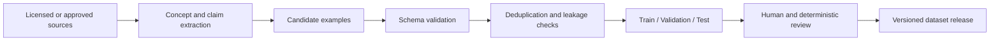

# Dataset Pipeline

## Objective

Produce small, clean, traceable datasets that teach one explicit behavior and can be independently evaluated.

## Lifecycle



## Required properties

Every record should have enough metadata to answer:

- what behavior it teaches;
- where its knowledge came from;
- whether the source is legally eligible;
- which language and domain it covers;
- its difficulty and expected output type;
- which dataset version and split contain it;
- which runs consumed it.

## Supported starting formats

### Conversational instruction tuning

```json
{"messages":[{"role":"user","content":"..."},{"role":"assistant","content":"..."}]}
```

### Prompt and completion

```json
{"prompt":"...","completion":"..."}
```

The format must match the trainer and the model's expected chat template. Standard Gemma and FunctionGemma tasks must not be mixed without an explicit transformation and evaluation plan.

## Validation gates

Before training, check:

1. valid JSON or JSONL;
2. required fields and roles;
3. empty values;
4. duplicate and near-duplicate records;
5. train/evaluation overlap;
6. invalid JSON inside expected model outputs;
7. excessive token lengths;
8. Arabic encoding and normalization;
9. inconsistent tool/function schemas;
10. provenance and license eligibility.

## Dataset size strategy

Start with a small dataset that is easy to inspect manually. Scale only after the evaluation proves that new examples improve the target behavior.

A larger synthetic dataset is not automatically better. It can amplify teacher errors, duplicates, style bias, and evaluation leakage.

## Versioning

Recommended identity:

```text
<domain>-<task>-v<major>.<minor>.<patch>
```

Every version should preserve:

- source manifest;
- transformation script version;
- validation report;
- split seed;
- record counts;
- known exclusions;
- runs that consumed it.
