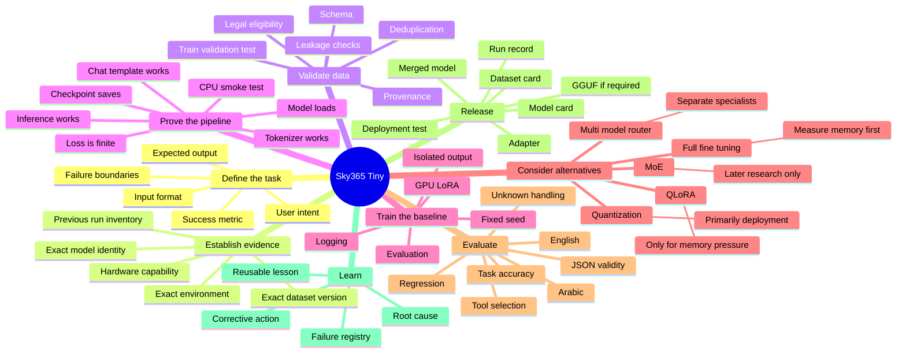
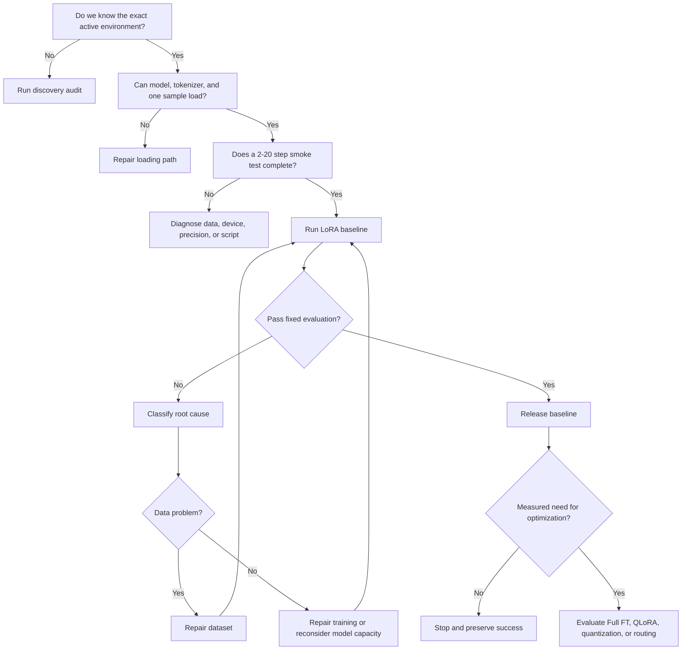

# Training Mind Map

This page is the conceptual map for Sky365 Tiny training. It separates proof, training, optimization, evaluation, and release so that complexity is introduced only when justified.

## Decision gates

## Core truth

- CPU is a diagnostic baseline, not the production training target.
- LoRA is the default first GPU method.
- QLoRA is conditional, not a compulsory next stage.
- Full fine-tuning is measured rather than dismissed because 270M is small.
- MoE is outside the immediate success path.
- No run is successful without independent evaluation and a loadable artifact.
